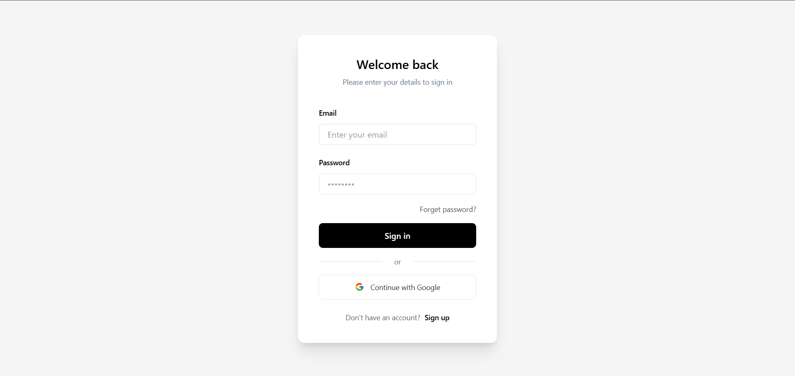

# Blog Platform App

blog platform is an full stack web application primary forces is to provide a platform to upload your blog posts and manage them and learn both front end and backend using React,Express,Nodejs and mongoDB

## Features

- secure Authentication using jwt and cookies
- store hashed passowrd using bcrypt
- view users blog posts
- Add, update, and delete Blog posts
- mordern userfriendly Ui design

## Installation

Clone the repository and install dependencies for both client and server.


1. Clone the repo:

```bash
git clone https://github.com/himathace/Blog.git
cd Blog
```

2. Set up the backend

```bash
cd server
npm install
cp .env.example .env
npm run dev
```

3. add Environment Variables

Create a .env file in the server folder based on .env.example.

```bash
MONGO_URI=your_mongodb_connection_string
JWT_SECRET=your_jwt_secret
```

3. Set up frontend:

```bash
cd ../client
npm install
npm run dev
```

## Screenshots





## Tech Stack

- Node.js
- Express.js
- MongoDB
- React
- JWT Authentication (backend)
- Express validator (backend)
- bcrypt (backend)
- jsonwebtoken (backend)
- mongoose (backend)
- nodemon (backend)
- Tailwind (frontend)

## Contributing

Contributions are welcome! Please open an issue first to discuss what you’d like to change.

Steps:
1. Fork the repository
2. Create your feature branch: `git checkout -b feature/YourFeature`
3. Commit your changes: `git commit -m 'Add your message'`
4. Push to the branch: `git push origin feature/YourFeature`
5. Open a pull request

## Author

- Himath Dewmika– [@himathace](https://github.com/himathace)


